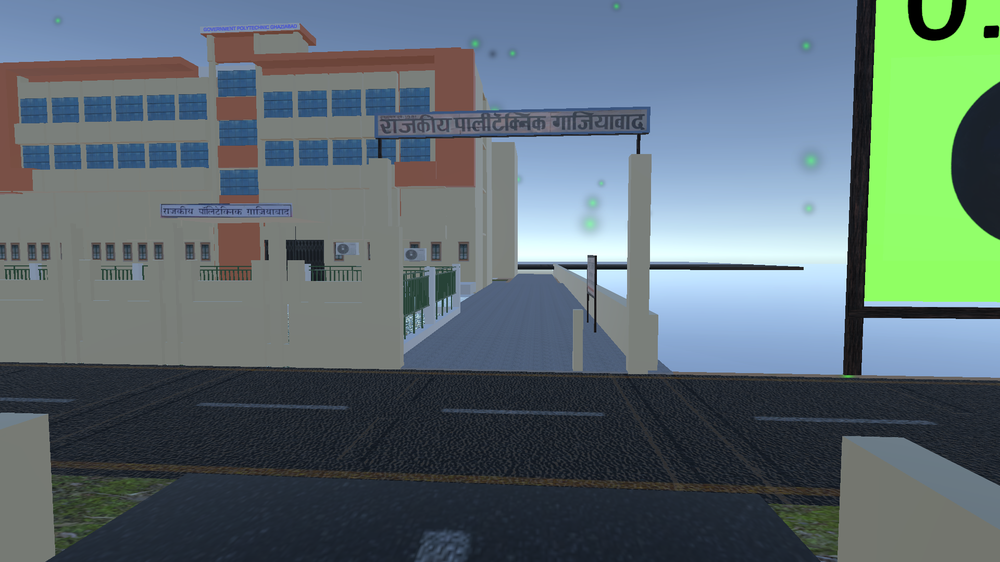
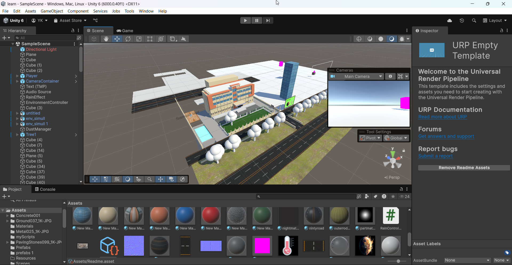
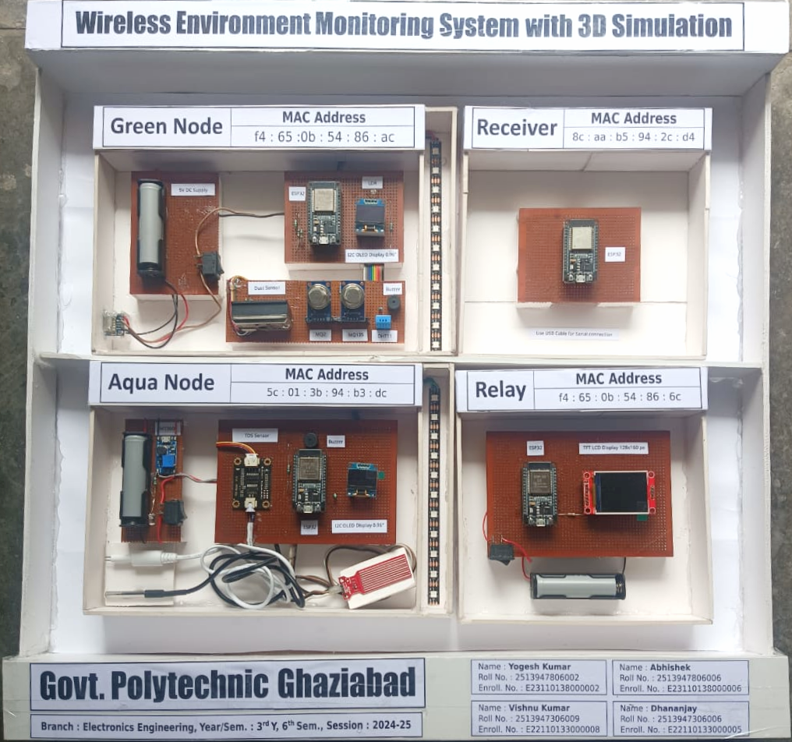

<h1 align="center">Govt. Polytechnic Ghaziabad, UP</h1>

<h2 align="center" style="color:#333;">
  Diploma in 
  Electronics 
  Engineering
</h2>

<h3 align="center">Session : 2024 - 25</h2>

<h2 align="center">Wireless Environment Monitoring System with 3D Simulation</h2>

> ⚠️ ** 3D Simulation Software coming soon!**

Thank you for visiting this repository. The full source code, circuit diagrams, and Unity simulation files for the **"Wireless Environment Monitoring System with 3D Simulation"** will be uploaded here within the next **7 to 15 days**.

---
<h3 align="center"> #3D Design </h3>

  

<h3 align="center"> Software </h3>

  

<h3 align="center"> Hardware </h3>

  

## 📘 Project Description

This project is a real-time wireless environmental monitoring system built using **ESP32 microcontrollers**, multiple **air and water quality sensors**, and a **Unity 3D simulation** to visualize live data.

It consists of:
- 🟢 **Green Node**: Monitors air quality (MQ2, MQ135, Dust, DHT11, LDR)
- 🔵 **Aqua Node**: Monitors water quality (TDS, Water Level, Temperature Probe)
- 📶 **Relay**: Forwards data from both nodes using ESP-NOW protocol
- 🖥️ **Receiver**: Sends received data to Unity for simulation via Serial

Unity responds with:
- Smoke, colored particles, water tank fill level, day/night effects  
- Audio alerts (`.wav` files) based on pollution or water contamination

---

## 📅 Status

✅ Hardware working  
✅ Data sending and visualization tested  
⏳ Project files being organized  
📤 Expected upload: **within 7–15 days**

---

## 👥 Team Members

- **Yogesh Kumar**  
- **Abhishek**  
- **Vishnu Kumar**  
- **Dhananjay**

> _Feel free to contact us for any queries, collaboration, or feedback._

---

⭐ Star the repo to get notified when the files are live!
